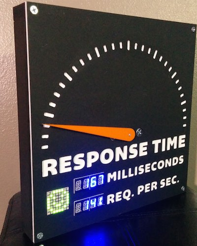

servometer
==========

Arduino project to display website performance on an analog meter using a servo. This project can be extended and modified to support all kinds of use cases, metrics, and APIs. Get people excited about performance and servers by making your own speedometer-like meter to display current response time, number of requests, or other important metrics.

##### components
This project includes 2 basic pieces:

* `servometer-host` - a NodeJS application to request data from an API or service and send to the Arduino over serial USB.
* `servometer` - the actual Arduino code to recieve data over serial and display using servos and LED displays.

